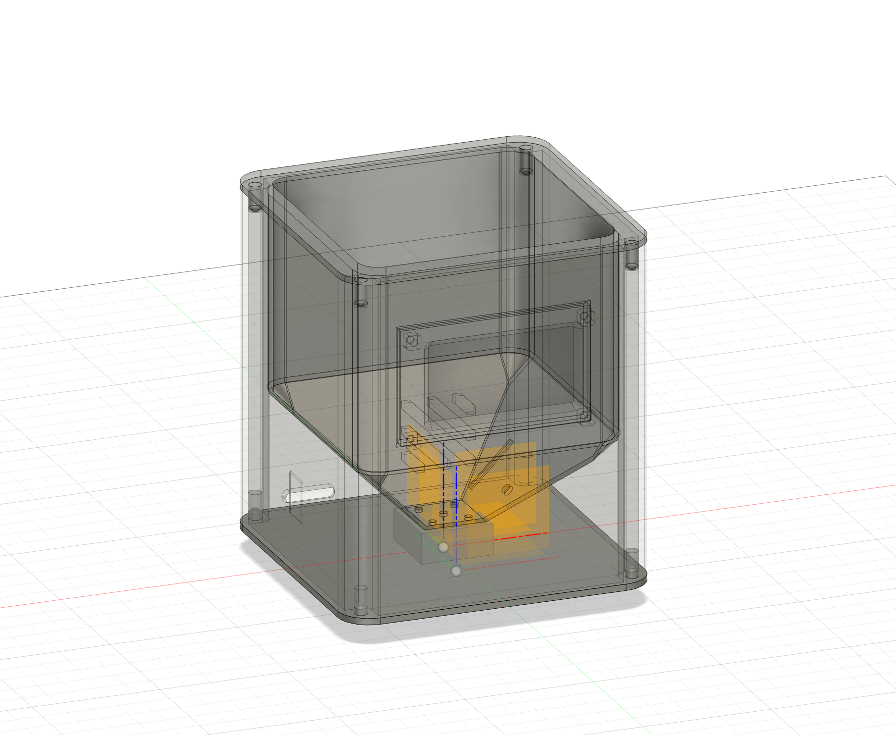

# Smart Planter 🌱

IoT plant monitoring system with real-time sensor data and automated Telegram alerts.


## Overview

ESP32-based environmental monitoring system that tracks air temperature, humidity, pressure, soil temperature, and soil moisture. Features local OLED display and remote monitoring via Telegram bot with configurable alert thresholds.

## Tech Stack

**Hardware:**
- ESP32 microcontroller
- BMP280 (I²C) - Air temp/pressure
- DS18B20 (OneWire) - Soil temperature probe
- Capacitive soil moisture sensor (Analog)
- 128x64 OLED display (SPI)
- Custom 3D-printed enclosure (Fusion 360)

**Software:**
- C++ firmware with modular architecture
- Multi-protocol communication (I²C, SPI, OneWire, ADC)
- Telegram Bot API integration
- Real-time threshold monitoring with alert cooldowns

## Features

- Real-time sensor data display
- Remote monitoring via Telegram (`/status` command)
- Automatic alerts for critical thresholds
- Custom-designed weatherproof enclosure
- Calibrated moisture sensing (20-60% optimal range)

## Mechanical Design



**Custom 3D-Printed Housing:**
- Snap-fit, 3-compartment design
- Weatherproof and soil resistant
- Ventilated BMP280 chamber for accurate readings
- Screw-mount OLED
- Modular sensor bracket system

**Design Files:**
- Fusion 360 source: `cad/enclosure.f3d`
- 3mf (3D printable): `cad/enclosure.stl`

## Repository Contents
```
├── src/           # Arduino firmware (modular C++)
├── hardware/      # Schematics and wiring diagrams
├── cad/           # Mesh file exports
├── docs/          # Technical notes and calibration data
└── images/        # Project photos and screenshots
```

## Key Challenges Solved

- **Power supply noise**: DS18B20 experiencing transient errors; resolved with filtering capacitors and input validation
- **Sensor calibration**: Two-point moisture calibration (air/water) achieving ±5% accuracy
- **Alert management**: Implemented 15-minute cooldown to prevent notification spam
  
## Demo

**Telegram Bot Commands:**
- `/status` - Current readings
- `/help` - Command list

**Alert Thresholds:**
- Air: 60-80°F | Soil: 60-75°F | Moisture: 20-60%

---

**Project Type:** Academic Capstone | **Status:** Complete  
Full project details and analysis: [Portfolio Link]
